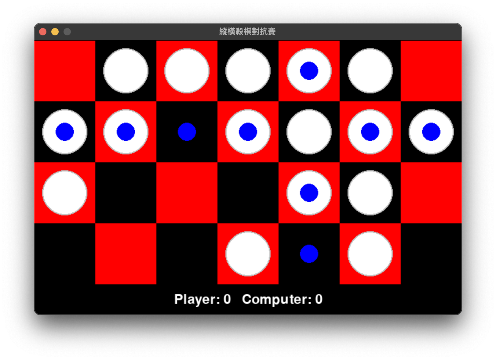

姓名: 王關平Kenneth Ong Kuan Phing 學號: 41047041S
1. 對於這次作業的編寫及測試使用的硬體和軟體為：
軟硬體規格:
- 2020 Macbook Air M1 
  - 8-core CPU with 4 perform­ance cores and 4 efficiency cores
  - 7-core GPU, 8-core GPU
  - 16-core Neural Engine
- python3 version 3.11.2
安裝需要的dependencies
```bash
pip install -r requirements.txt
```
執行檔案方式為
```bash
python <filename>.py
```

使用原因:
- 我只有這台筆電
- python語法簡單明瞭

3. 製造測資
我使用隨機的方式製作下列測資，並從中挑選自己覺得難度不一的
產生測資的源代碼在 [generate-test.py](generate-test.py)
  -
```bash
4 3
0 0 1 
0 1 0 
0 1 1 
1 1 1 
```
  -
```bash
4 7
0 1 1 1 1 1 0 
1 1 0 1 1 1 1 
1 0 0 0 1 1 0 
0 0 0 1 0 1 0 
```
  -
```bash
8 4
1 1 0 0 
1 0 0 1 
1 1 0 0 
0 1 1 1 
1 0 1 0 
1 0 1 1 
1 1 1 0 
1 0 0 1 
```
  -
```bash
6 7
0 1 1 0 1 1 0 
0 1 1 1 0 0 0 
1 1 1 0 1 0 1 
1 0 1 0 0 0 1 
1 0 1 1 1 1 0 
1 0 1 0 1 1 0 
```
  -
```bash
8 8
1 1 0 1 1 1 1 1 
0 0 0 1 1 1 1 0 
0 1 0 1 1 0 1 1 
0 0 0 1 0 0 1 0 
1 0 0 1 1 0 1 1 
1 1 1 1 1 0 1 1 
1 0 0 0 0 0 1 0 
0 1 1 0 0 1 0 1 
```

4. 作業中，使用的方法為alpha beta pruning，找出讓自己勝算最多的一步
Alpha Beta Pruning是一种搜索算法，其中使用的技術為Minimax Algorithm，但再利用alpha beta值進行優化，省略沒必要進行計算的節點
Alpha Beta Pruning主要应用于机器游玩的二人游戏，如象棋、圍棋等等

5. 參考文獻及網站
  - 參考alpha beta pruning的pseudo code
    - https://en.wikipedia.org/wiki/Alpha%E2%80%93beta_pruning 
    - https://www.javatpoint.com/ai-alpha-beta-pruning
  - 參考如何使用python實現alpha beta pruning
    - https://www.geeksforgeeks.org/minimax-algorithm-in-game-theory-set-4-alpha-beta-pruning/
    - https://tonypoer.io/2016/10/28/implementing-minimax-and-alpha-beta-pruning-using-python/
  - 參考其如何使用pygame製作圖形化介面並使用minimax演算法作為電腦下棋的原理
    - https://github.com/techwithtim/Python-Checkers-AI/

6. 過程中碰到的困難為
- 如何紀錄盤面每一個state，紀錄他目前正反方的計分，下了row或column(最終回傳需要)
- 如何比較alpha和beta的值，必要時呼叫break，才能發揮alpha beta pruning的優勢
- 如何製作一個圖形化介面，並把alpha beta pruning演算法納入其中

## 如何使用圖形化介面
1. 選擇你要下的棋子（選後將會有row和col的棋步可選）
2. 選擇你要下的方向
  -  若要下row的話，就選擇與棋子同一行的格子
  -  若要下col的話，就選擇與棋子同一列的格子
